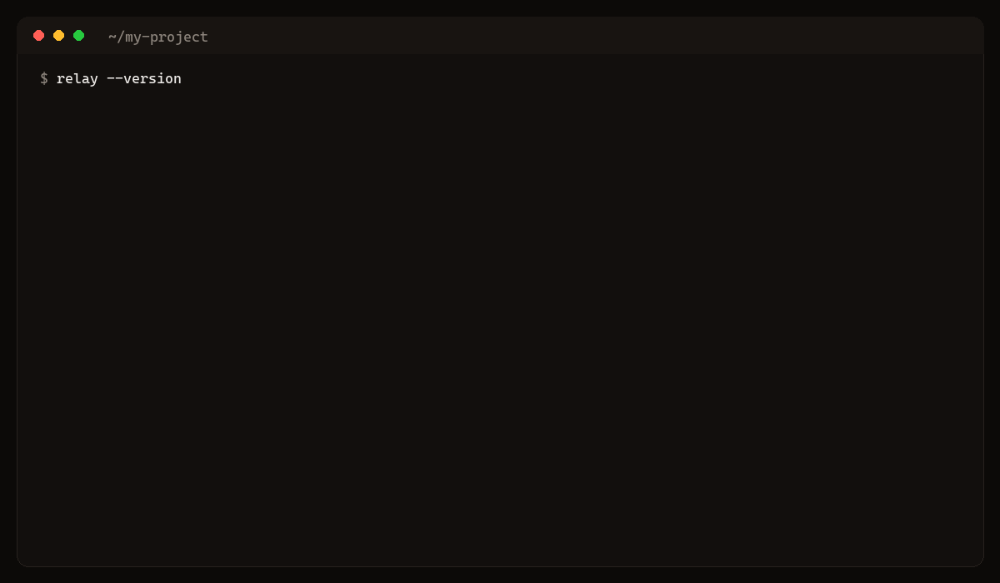
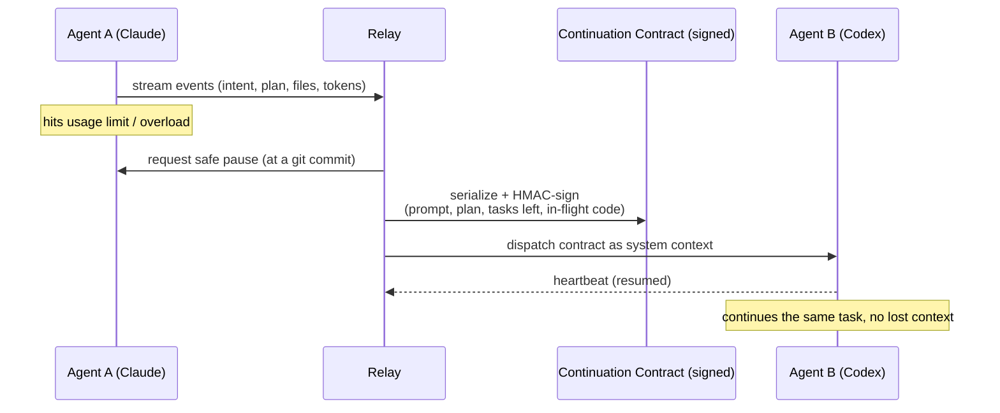
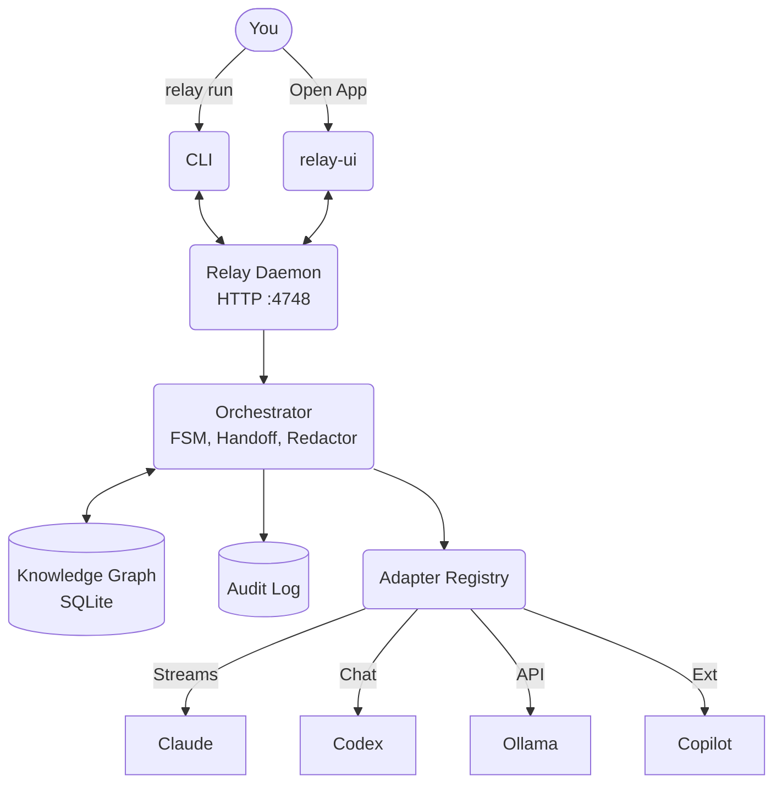

<!--
  Relay: vendor-neutral AI coding agent orchestrator
  README. Source of truth lives in docs/. Keep them in sync.
-->

<div align="center">

```
 ██████╗ ███████╗██╗      █████╗ ██╗   ██╗
 ██╔══██╗██╔════╝██║     ██╔══██╗╚██╗ ██╔╝
 ██████╔╝█████╗  ██║     ███████║ ╚████╔╝
 ██╔══██╗██╔══╝  ██║     ██╔══██║  ╚██╔╝
 ██║  ██║███████╗███████╗██║  ██║   ██║
 ╚═╝  ╚═╝╚══════╝╚══════╝╚═╝  ╚═╝   ╚═╝
```

**Your AI coding agents are about to hit their limits. Relay keeps them going.**

_The handoff protocol for AI coding agents: a signed, portable contract that carries intent, plan, and in-flight code from one agent to the next._

Relay detects the Claude Code / Codex / Copilot / Cursor / Cline / Antigravity sessions **already running on your machine**, reads what each one is doing, and hands the work to a fresh agent, account, or provider before any of them runs out of quota. One subscription dies, the task lives on another.

_Vendor-neutral. Works across Claude, Codex, Antigravity, OpenCode, Ollama, Copilot, Continue, Cline, Cursor._

[](https://golang.org)
[](https://www.rust-lang.org)
[](LICENSE)
[](https://dbisina.github.io/relay)

[Docs](https://dbisina.github.io/relay) · [Architecture](docs/architecture.md) · [Providers](docs/providers.md) · [Contributing](CONTRIBUTING.md)

</div>

---

## 60-second quickstart

**Prerequisites:** git, plus at least one AI agent CLI installed and authenticated (for example `npm i -g @anthropic-ai/claude-code` then `claude login`).

**macOS / Linux**
```bash
curl -fsSL https://raw.githubusercontent.com/dbisina/relay/main/scripts/install.sh | bash
```

**Windows** (PowerShell)
```powershell
irm https://raw.githubusercontent.com/dbisina/relay/main/scripts/install.ps1 | iex
```

### Run a task
```bash
cd my-project
relay init
relay run "add a refund flow to the orders service"
```

Opening the desktop app starts the daemon for you and leaves it running after you close the window, so the CLI keeps working against the same orchestrator.

> **Recommended path:** the installers above pull a prebuilt binary from the latest GitHub Release, which is fast but depends on that release's cross-platform build having gone cleanly for your OS. Cloning and building from source is the most reliable route, always matches the current code, and is what the maintainers actually run day to day:
> ```bash
> git clone https://github.com/dbisina/relay && cd relay
> ./scripts/setup.sh        # macOS/Linux, self-healing: installs missing Go/Rust/git
> ./scripts/setup.ps1       # Windows
> ```
> See [Contributing](CONTRIBUTING.md) for the full dev-loop setup.



---

## The problem: context fragmentation

As coding agents get more specialized, the bottleneck stops being any single
model and becomes the **handoff between them**. An agent hits a usage limit, or
you want a different model for the next step, and the intent, the plan, the
half-finished edits, and the "do not redo this" knowledge evaporate. You paste
context by hand and hope.

Relay treats the handoff as a first-class, signed protocol. When an agent hits a
wall, Relay pauses it at a safe point, serializes what it was doing into a
signed **continuation contract**, and resumes a fresh agent, account, or provider
from that contract, with no lost state.



## Why Relay?

Most devs juggle several AI coding subscriptions because it's cheaper than burning API credits. The pain: when one agent hits its limit mid-task, the work stalls and the context is lost. Relay fixes that. It's built for **subscription arbitrage**, keeping the work flowing across every account and provider you own.

```bash
relay detect          # find every AI agent already running on this machine
relay detect --adopt <id> --target codex --start   # lift its work, continue on another agent
```

| Feature | Description |
| :--- | :--- |
| **Detect running agents** | Scans processes + on-disk transcripts. Surfaces each session's prompt, plan, tasks-left, files, skills, MCPs and token usage. Claude Code, Codex, Copilot (CLI + VS Code), Cursor, Cline, Continue, Antigravity. |
| **Adopt and port** | One command lifts a detected session into a signed continuation contract and resumes it on another agent. From the desktop app or `relay detect --adopt`. |
| **Account auto-failover** | Claude account A exhausted? Relay resumes on account B, same model, **$0 of API credit**, then crosses to another provider only when all your logins are spent. |
| **Quota wallet** | Every provider + account's remaining quota, reset time, and burn-rate ETA in one panel. Route the next task to whoever has headroom. |
| **Predictive handoff** | Forecasts time-to-exhaustion from live burn rate and hands off at a safe point *before* the wall, no work lost mid-edit. |
| **Time machine** | Every handoff snapshots git + a signed contract. Diff what each agent did; non-destructively rewind to any step. |
| **Pipeline designer** | Compose multi-agent DAGs in the UI: an agent per part, explicit ordering, fallback-on-snag routing. |
| **Continuation contract** | HMAC-signed Markdown + JSON carrying goal, plan, decisions, constraints, file manifest, in-flight code. Survives provider boundaries. |
| **Knowledge + code graph** | SQLite store of decisions/constraints/files + a one-shot symbol scan (Go, Rust, TS, Py, Java), searchable via FTS5 at `/api/retrieval`. |
| **Secret redactor** | AWS / OpenAI / Anthropic / GitHub / JWT patterns scrubbed before anything crosses a boundary. |
| **MCP server** | `relay mcp` exposes the whole API as tools, so any MCP client (Claude Desktop, Cursor, Cline) can drive Relay. |

## Provider matrix

| Provider | Install | Auth | Local/Cloud |
|---|:---:|:---:|:---:|
| **Claude** | `npm` | `claude login` | Cloud |
| **Codex** | `npm` | API Key | Cloud |
| **Antigravity** | manual | manual | Cloud |
| **OpenCode** | `brew`/`npm` | API Key | Cloud |
| **Ollama** | `brew`/`winget` | - | Local |
| **GitHub Copilot** | `gh ext` | `gh auth login`| Cloud |
| **Continue** / **Cline**| VS Code | ext | Both |

*Auto-detected on first probe via PATH, Extensions, npm, brew, or winget.*

## Architecture



See [Architecture Docs](docs/architecture.md) for the full picture, including the handoff state machine.

## Use with another LLM client (MCP)

Relay also runs as a **Model Context Protocol** server. Any MCP-aware client (Claude Desktop, Cursor, Cline, Continue) can call into Relay to hand off, query session state, retrieve code context, send replies.

```jsonc
// Claude Desktop config
{
  "mcpServers": {
    "relay": {
      "command": "relay",
      "args": ["mcp"]
    }
  }
}
```

## The handoff contract (the protocol)

The unit Relay standardizes is the **continuation contract**: an HMAC-signed
document (Markdown for humans + a JSON sidecar for machines) that any agent can
be resumed from. Schema v2 carries:

- `initialPrompt`: the original ask, verbatim
- `plan` / `tasksRemaining`: the plan as the source agent tracked it, and what is left
- `skillsLoaded` / `skillsInUse`: capabilities the session had
- `inFlightCode`: files mid-edit with truncated snippets
- `decisions` / `constraints` / `doNotRedo`: hard-won context that must survive the boundary

It is signed with the project's `.relay/.signing-key`, so a receiving agent can
verify the contract was produced by your Relay and not tampered with in transit.
See [docs/architecture.md](docs/architecture.md) for the full schema.

## See the handoff

The handoff is runnable today from the CLI:

```bash
# Force a handoff early to watch the full cycle on one task
relay run "refactor the orders service" --force-handoff 0.5

# Or lift an agent that is ALREADY running and continue it on another provider
relay detect --adopt <id> --target codex --start
```

Watch the `handoff` events stream in the TUI (`relay tui`) or the desktop app.

## Roadmap

- Contract schema v3: richer memory (embeddings-backed retrieval is scaffolded in `internal/codegraph`).
- More agent adapters and community-contributed detection for new session stores.
- A published, versioned spec for the continuation contract so third-party agents can emit and consume it directly.
- Persistence layer options for the knowledge graph beyond local SQLite.
- Desktop UI design pass (see [issue #1](https://github.com/dbisina/relay/issues/1)).

## Documentation

- [Getting started](docs/getting-started.md)
- [Architecture](docs/architecture.md)
- [Providers](docs/providers.md)
- [Profiles and routing](docs/profiles.md)
- [Vision fallback](docs/vision.md)
- [Security and privacy](docs/security.md)
- [API reference](docs/api-reference.md)
- [CLI reference](docs/cli-reference.md)
- [MCP server](docs/mcp.md)

Repo map for contributing agents: [CODEMAP.md](CODEMAP.md). Agent rules: [CLAUDE.md](CLAUDE.md) / [AGENTS.md](AGENTS.md).

## Contributing

Contributions are welcome. See the [Contributing Guide](CONTRIBUTING.md) and [Code of Conduct](CODE_OF_CONDUCT.md). The setup script is self-healing: it installs any missing toolchain (Go, Rust, git) before building.

```bash
git clone https://github.com/dbisina/relay
cd relay

# One-shot setup (installs missing tools automatically)
./scripts/setup.sh        # macOS/Linux
./scripts/setup.ps1       # Windows

# Dev loop
./scripts/dev.sh          # daemon + UI in parallel
```

## License

Apache-2.0. See [LICENSE](LICENSE). Built on top of work from Anthropic Claude Code, OpenAI Codex CLI, Ollama, egui, and Bubble Tea. Full credits in [OPEN_SOURCE.md](OPEN_SOURCE.md).

[](https://star-history.com/#dbisina/relay&Date)
